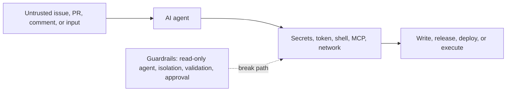

# WorkflowPromptGuard

[](https://github.com/devUmut35/WorkflowPromptGuard/actions/workflows/ci.yml)
[](https://www.python.org/)
[](LICENSE)

Trace untrusted GitHub content to AI-agent capabilities before prompt injection becomes a
repository compromise.

WorkflowPromptGuard is an offline boundary linter for GitHub Agentic Workflows and conventional
GitHub Actions jobs that run Claude, Codex, Copilot, or Gemini. It does not try to recognize
phrases such as "ignore previous instructions." Those checks are noisy and bypassable. It asks a
more useful question:

> Can attacker-controlled content reach an agent that can read secrets, run broad tools,
> communicate externally, or mutate GitHub resources?

## Why another workflow scanner?

General GitHub Actions scanners already cover workflow syntax and common CI mistakes.
WorkflowPromptGuard focuses on the newer agent boundary:



- Boundary-aware rules connect sources, agents, capabilities, and sinks.
- GitHub Agentic Workflow frontmatter (`.github/workflows/*.md`) is supported directly.
- Conventional `.yml` and `.yaml` agent jobs are scanned with known action adapters.
- Console, JSON, Markdown, and SARIF 2.1.0 reports share stable rule IDs and fingerprints.
- Evidence traces explain the path that made a finding exploitable.
- The default scan is deterministic, local-only, and needs no GitHub token or network access.

## Hosted issue bot

You can try WorkflowPromptGuard without installing anything:

1. Open a new issue in this repository.
2. Choose **Scan a public repository**.
3. Enter exactly one URL such as `https://github.com/OWNER/REPOSITORY`.
4. The bot pins the target's default branch to a commit, scans its workflow files, and posts the
   result on the issue.

The comment contains two deliberately separate sections:

- **Deterministic findings** come from WorkflowPromptGuard's rules and remain the source of truth.
- **AI-generated explanation** is an optional plain-language summary from GitHub Models.

No separate API key is stored. GitHub Actions supplies a short-lived `GITHUB_TOKEN`, and GitHub
Models provides free, rate-limited inference. If the free quota or model service is unavailable,
the deterministic report is still posted.

Every valid form submission receives an automatic deterministic scan. To prevent public issue
spam from exhausting the free model quota, AI explanations run automatically for repository
owners, members, and collaborators; a maintainer can approve another request with the
`ai-approved` label.

The hosted bot only supports public GitHub repositories. It fetches files directly under
`.github/workflows` at an immutable commit SHA, never clones or executes target code, and never
sends issue text or workflow source to the model. Only bounded rule IDs, severities, counts, and
catalog-authored remediation text reach the AI explanation stage.

See the [hosted issue bot documentation](docs/issue-bot.md) for its limits and security boundary.

## Quick start

Install from the repository:

```bash
python -m pip install "git+https://github.com/devUmut35/WorkflowPromptGuard.git"
```

Scan a repository and fail on High or Critical findings:

```bash
wpg scan .
```

Generate SARIF for GitHub code scanning or another compatible platform:

```bash
wpg scan . --format sarif --output workflow-prompt-guard.sarif
```

Inspect the public rule catalog:

```bash
wpg rules
wpg explain AI001
```

Exit codes are designed for CI:

| Code | Meaning |
| ---: | --- |
| `0` | Scan completed and the policy passed |
| `1` | At least one finding reached `--fail-on` |
| `2` | Discovery, parse, configuration, or output failure |

## Example finding

```text
CRITICAL AI001 .github/workflows/assistant.yml:18:9
  Untrusted content reaches a write-capable agent
  Attacker-controlled event content reaches an agent with direct write scopes: contents.
  Trace: untrusted GitHub event content -> agent step: Review issue -> GITHUB_TOKEN: contents
  Fix: Keep the agent read-only and apply validated, structured output in a separate
       least-privilege job.
```

## GitHub Action

Pin the action to the immutable commit behind `v0.1.0`:

```yaml
name: Agent workflow security

on:
  pull_request:

permissions:
  contents: read

jobs:
  workflow-prompt-guard:
    runs-on: ubuntu-latest
    steps:
      - uses: actions/checkout@d23441a48e516b6c34aea4fa41551a30e30af803 # v6.1.0
      - uses: actions/setup-python@ece7cb06caefa5fff74198d8649806c4678c61a1 # v6.3.0
        with:
          python-version: "3.13"
      - uses: devUmut35/WorkflowPromptGuard@ab613a765c4e44d65ef95a9e1a2d21dbcec79820 # v0.1.0
        with:
          fail-on: high
```

GitHub documents that a full-length commit SHA is the only immutable action reference.

## Implemented rules

| Rule | Default | Boundary checked |
| --- | --- | --- |
| `AI001` | Critical | Untrusted content reaches a write-capable agent |
| `AI002` | Critical | A secret enters the agent trust domain |
| `AI003` | Critical | Agent output reaches executable code |
| `AI004` | High | Strict mode, integrity, or threat detection is disabled |
| `AI005` | High | Shell, tool, repository, or network capability is unrestricted |
| `AI006` | High | A safe output can select broad cross-repository targets |
| `AI007` | High | An agent shares a mutable job with a later privileged step |
| `AI008` | Medium | External actors can trigger an unbounded agent run |
| `GA001` | Critical | `pull_request_target` executes pull-request code |
| `GA002` | High | Untrusted GitHub expressions are interpolated into `run` |
| `GA003` | Medium | An external action uses a mutable reference |
| `GA004` | Medium | An agent workflow token is not explicitly least privilege |

See the [rule reference](docs/rules.md) for detection logic, evidence, and false-positive controls.

## Policy file

Create `.workflow-prompt-guard.yml` in the repository root:

```yaml
version: 1
fail_on: high
include_generated: false

exclude:
  - vendor/**

ignore:
  - rule: AI002
    path: .github/workflows/reviewer.yml
    reason: Provider credential is isolated by the reviewed proxy wrapper.
    expires: 2026-12-31
```

Suppressions require a reason and may carry an expiry date. Expired suppressions stop matching.

## Threat model and limits

WorkflowPromptGuard assumes the model can be prompt-injected. Prompt wording is not treated as a
security boundary. The desired architecture keeps the agent read-only and secret-free, constrains
tools and egress, and applies validated writes from a separate scoped job.

Offline analysis cannot see organization token defaults, repository visibility, environment
protection rules, or the runtime behavior of unknown wrapper actions. Findings therefore describe
evidence visible in source; absence of findings is not proof that a workflow is secure. Read the
complete [threat model](docs/threat-model.md).

The rule design follows GitHub's guidance on
[secure use of Actions](https://docs.github.com/en/actions/reference/security/secure-use),
[script injection](https://docs.github.com/en/actions/concepts/security/script-injections), and
the [GitHub Agentic Workflows security architecture](https://github.blog/ai-and-ml/generative-ai/under-the-hood-security-architecture-of-github-agentic-workflows/).

## Development

```bash
git clone https://github.com/devUmut35/WorkflowPromptGuard.git
cd WorkflowPromptGuard
python -m venv .venv
# activate the environment, then:
python -m pip install -e ".[dev]"
ruff check .
ruff format --check .
mypy src
bandit -r src -ll
pytest --cov
```

See [CONTRIBUTING.md](CONTRIBUTING.md) before proposing rules or adapters. Security issues should
be reported privately according to [SECURITY.md](SECURITY.md).

## License

Copyright 2026 Umutcan Altan. Licensed under the [Apache License 2.0](LICENSE).
