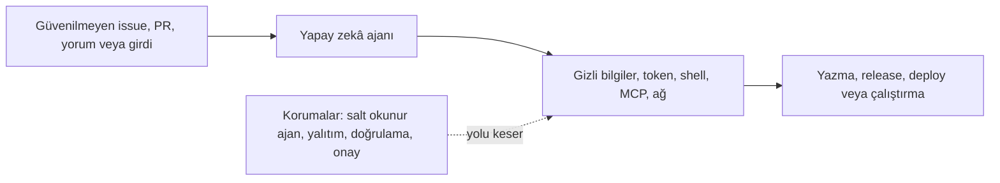

# WorkflowPromptGuard

[English](README.md) | **Türkçe**

[](https://github.com/devUmut35/WorkflowPromptGuard/actions/workflows/ci.yml)
[](https://www.python.org/)
[](LICENSE)

İstem enjeksiyonu bir depo ihlaline dönüşmeden önce güvenilmeyen GitHub içeriğinin yapay zekâ
ajanı yeteneklerine nasıl ulaştığını izleyin.

WorkflowPromptGuard; Claude, Codex, Copilot veya Gemini çalıştıran GitHub Agentic Workflows ve
geleneksel GitHub Actions job'ları için çevrimdışı bir güven sınırı denetleyicisidir. “Önceki
talimatları yok say” gibi ifadeleri aramaya çalışmaz; bu kontroller gürültülüdür ve kolayca
aşılabilir. Bunun yerine daha yararlı bir soru sorar:

> Saldırganın denetlediği içerik; gizli bilgileri okuyabilen, geniş araçlar çalıştırabilen,
> dışarıyla iletişim kurabilen veya GitHub kaynaklarını değiştirebilen bir ajana ulaşabiliyor mu?

## Neden başka bir iş akışı tarayıcısı?

Genel GitHub Actions tarayıcıları iş akışı sözdizimini ve yaygın CI hatalarını zaten denetler.
WorkflowPromptGuard daha yeni olan ajan güven sınırına odaklanır:



- Sınır farkındalıklı kurallar kaynakları, ajanları, yetenekleri ve etkili hedefleri birbirine bağlar.
- GitHub Agentic Workflow frontmatter dosyaları (`.github/workflows/*.md`) doğrudan desteklenir.
- Geleneksel `.yml` ve `.yaml` ajan job'ları bilinen action bağdaştırıcılarıyla taranır.
- Konsol, JSON, Markdown ve SARIF 2.1.0 raporları kararlı kural kimlikleri ve parmak izleri kullanır.
- Kanıt izleri, bir bulguyu sömürülebilir yapan yolu açıklar.
- Varsayılan tarama deterministiktir, yalnızca yerelde çalışır ve GitHub token'ı ya da ağ erişimi
  gerektirmez.

## Barındırılan issue botu

WorkflowPromptGuard'ı kurulum yapmadan deneyebilirsiniz:

1. Bu depoda yeni bir issue açın.
2. **Herkese açık depoyu tara / Scan a public repository** formunu seçin.
3. Rapor dili olarak **Türkçe** veya **English** seçin.
4. `https://github.com/OWNER/REPOSITORY` biçiminde tam olarak bir URL girin.
5. Bot hedefin varsayılan dalını bir commit'e sabitler, iş akışı dosyalarını tarar ve sonucu
   seçtiğiniz dilde issue'ya ekler.

Yapay zekâ etkin olduğunda bot yorumu iki bölümü özellikle ayrı tutar:

- **Deterministik bulgular**, WorkflowPromptGuard kurallarından gelir ve esas alınması gereken
  sonuçtur.
- **Yapay zekâ tarafından oluşturulan açıklama**, LLM7.io'nun anonim `default` rotasından gelen
  isteğe bağlı sade dil özetidir.

Model çağrısı ayrı bir API anahtarı olmadan `https://api.llm7.io/v1/chat/completions` adresine
yapılır. GitHub Actions, GitHub API ve issue yorumu işlemleri için kısa ömürlü `GITHUB_TOKEN`
kimlik bilgileri sağlar; ancak bu token hiçbir zaman LLM7.io'ya gönderilmez.

LLM7.io şu anda anonim kullanım için saatte 60 istek ve kayan 24 saatlik dönemde toplam 500.000
giriş-çıkış tokenı sınırı belgelemektedir. Anonim kullanım verileri analiz ve model iyileştirme
amacıyla işlenebilir. `default` rotası farklı temel modeller seçebilir; kullanılabilirlik veya aynı
sonucu yeniden üretme garantisi yoktur. Kota, sağlayıcı, yanıt doğrulama ya da yönlendirme hatasında
eksiksiz deterministik rapor yine yayımlanır. Resmî [LLM7.io hizmet
bilgilerini](https://llm7.io/), [anonim limitleri](https://docs.llm7.io/limits) ve [model seçici
belgesini](https://docs.llm7.io/guides/models) inceleyebilirsiniz.

Geçerli her form isteği otomatik deterministik tarama alır. Herkese açık issue spam'inin anonim
sağlayıcı kotasını tüketmesini önlemek için yapay zekâ açıklaması yalnızca isteği açan kullanıcının
bu WorkflowPromptGuard deposundaki ilişkisi `OWNER`, `MEMBER` veya `COLLABORATOR` olduğunda
otomatik çalışır. Bir depo yöneticisi diğer istekleri `ai-approved` etiketiyle onaylayabilir.

Bot yalnızca herkese açık GitHub depolarını destekler. Hedefin varsayılan dalının tam commit SHA
değerini belirler ve okumaları bu değişmez sürüme sabitler. Yalnızca `.github/workflows` dizininin
doğrudan altındaki dosyaları getirir; hedef kodu klonlamaz veya çalıştırmaz. Depo kimliği, commit
SHA, issue metni, iş akışı kaynağı ve dosya yolları modele gönderilmez. Anonim LLM7.io isteği
yalnızca normalize edilmiş `language`, `scanned_files`, `counts` ve katalog destekli `rules`
agregalarını içerir.

Sınırlar ve güvenlik modeli için
[Türkçe issue botu belgesini](docs/issue-bot.tr.md) okuyun.

## Hızlı başlangıç

Depodan kurun:

```bash
python -m pip install "git+https://github.com/devUmut35/WorkflowPromptGuard.git"
```

Bir depoyu tarayın ve High ya da Critical bulgularda başarısız olun:

```bash
wpg scan .
```

GitHub code scanning veya başka bir uyumlu platform için SARIF üretin:

```bash
wpg scan . --format sarif --output workflow-prompt-guard.sarif
```

Herkese açık kural kataloğunu inceleyin:

```bash
wpg rules
wpg explain AI001
```

Çıkış kodları CI kullanımı için tasarlanmıştır:

| Kod | Anlam |
| ---: | --- |
| `0` | Tarama tamamlandı ve ilke kontrolü geçti |
| `1` | En az bir bulgu `--fail-on` eşiğine ulaştı |
| `2` | Keşif, ayrıştırma, yapılandırma veya çıktı hatası oluştu |

## Örnek bulgu

CLI ve makine çıktıları kararlılık için kanonik olarak İngilizcedir:

```text
CRITICAL AI001 .github/workflows/assistant.yml:18:9
  Untrusted content reaches a write-capable agent
  Attacker-controlled event content reaches an agent with direct write scopes: contents.
  Trace: untrusted GitHub event content -> agent step: Review issue -> GITHUB_TOKEN: contents
  Fix: Keep the agent read-only and apply validated, structured output in a separate
       least-privilege job.
```

## GitHub Action

Action'ı `v0.2.0` sürümünün değişmez commit'ine sabitleyin:

```yaml
name: Agent workflow security

on:
  pull_request:

permissions:
  contents: read

jobs:
  workflow-prompt-guard:
    runs-on: ubuntu-latest
    steps:
      - uses: actions/checkout@d23441a48e516b6c34aea4fa41551a30e30af803 # v6.1.0
      - uses: actions/setup-python@ece7cb06caefa5fff74198d8649806c4678c61a1 # v6.3.0
        with:
          python-version: "3.13"
      - uses: devUmut35/WorkflowPromptGuard@5320af60205ab3e1bb549c5f0b6c01e657c7b729 # v0.2.0
        with:
          fail-on: high
```

GitHub'a göre tam uzunlukta commit SHA, bir action için tek değişmez referanstır.

## Uygulanan kurallar

| Kural | Varsayılan | Denetlenen sınır |
| --- | --- | --- |
| `AI001` | Critical | Güvenilmeyen içerik, yazma yetkili bir ajana ulaşır |
| `AI002` | Critical | Gizli bilgi ajanın güven alanına girer |
| `AI003` | Critical | Ajan çıktısı çalıştırılabilir koda ulaşır |
| `AI004` | High | Strict mode, bütünlük veya tehdit algılama kapatılmıştır |
| `AI005` | High | Shell, araç, depo veya ağ yeteneği sınırsızdır |
| `AI006` | High | Güvenli çıktı, geniş depolar arası hedefler seçebilir |
| `AI007` | High | Ajan, daha sonraki ayrıcalıklı adımla değiştirilebilir bir job paylaşır |
| `AI008` | Medium | Dış aktörler sınırsız bir ajan çalışması tetikleyebilir |
| `GA001` | Critical | `pull_request_target`, pull request kodunu çalıştırır |
| `GA002` | High | Güvenilmeyen GitHub ifadeleri doğrudan `run` içine eklenir |
| `GA003` | Medium | Harici action değiştirilebilir bir referans kullanır |
| `GA004` | Medium | Ajan iş akışı token'ı açıkça en az ayrıcalıklı değildir |

Algılama mantığı, kanıt ve yanlış pozitif kontrolleri için
[kural referansına](docs/rules.md) bakın.

## İlke dosyası

Depo kökünde `.workflow-prompt-guard.yml` oluşturun:

```yaml
version: 1
fail_on: high
include_generated: false

exclude:
  - vendor/**

ignore:
  - rule: AI002
    path: .github/workflows/reviewer.yml
    reason: Provider credential is isolated by the reviewed proxy wrapper.
    expires: 2026-12-31
```

Yok saymalar bir gerekçe gerektirir ve son kullanma tarihi taşıyabilir. Süresi dolan yok saymalar
eşleşmeyi bırakır.

## Tehdit modeli ve sınırlar

WorkflowPromptGuard modelin istem enjeksiyonuna uğrayabileceğini varsayar. İstem metni bir güvenlik
sınırı sayılmaz. Hedef mimari; ajanı salt okunur ve gizli bilgilerden uzak tutar, araçlarla dış
erişimi sınırlar ve doğrulanmış yazma işlemlerini ayrı, dar yetkili bir job'da uygular.

Çevrimdışı analiz; organizasyon token varsayılanlarını, depo görünürlüğünü, environment koruma
kurallarını veya bilinmeyen wrapper action'ların çalışma zamanı davranışını göremez. Bu nedenle
bulgular yalnızca kaynakta görülen kanıtı açıklar; bulgu olmaması iş akışının güvenli olduğunu
kanıtlamaz. Ayrıntılı [tehdit modelini](docs/threat-model.md) okuyun.

Kural tasarımı GitHub'ın
[Actions'ı güvenli kullanma](https://docs.github.com/en/actions/reference/security/secure-use),
[betik enjeksiyonu](https://docs.github.com/en/actions/concepts/security/script-injections) ve
[GitHub Agentic Workflows güvenlik mimarisi](https://github.blog/ai-and-ml/generative-ai/under-the-hood-security-architecture-of-github-agentic-workflows/)
rehberlerini izler.

## Geliştirme

```bash
git clone https://github.com/devUmut35/WorkflowPromptGuard.git
cd WorkflowPromptGuard
python -m venv .venv
# ortamı etkinleştirdikten sonra:
python -m pip install -e ".[dev]"
ruff check .
ruff format --check .
mypy src
bandit -r src -ll
pytest --cov
```

Kural veya bağdaştırıcı önermeden önce [CONTRIBUTING.md](CONTRIBUTING.md) dosyasını okuyun.
Güvenlik sorunlarını [SECURITY.md](SECURITY.md) uyarınca özel olarak bildirin.

## Lisans

Telif hakkı 2026 Umutcan Altan. [Apache License 2.0](LICENSE) kapsamında lisanslanmıştır.
